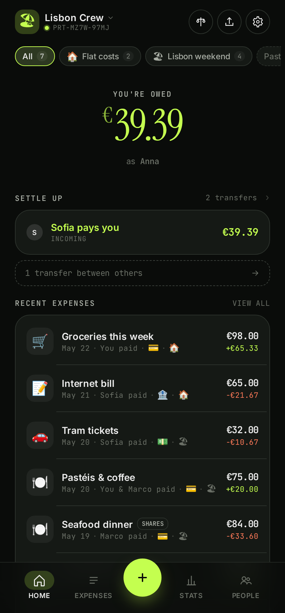
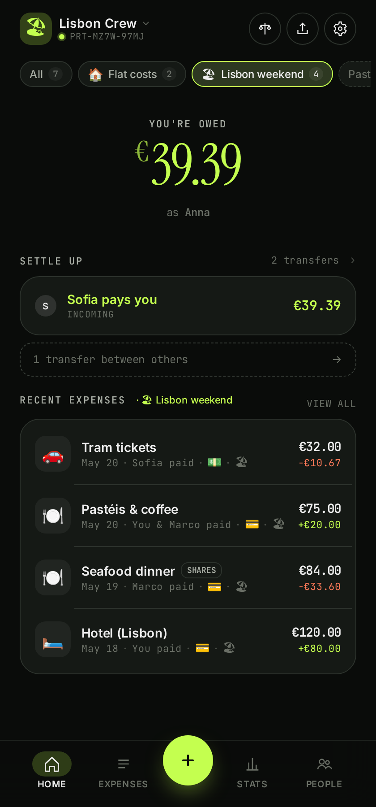
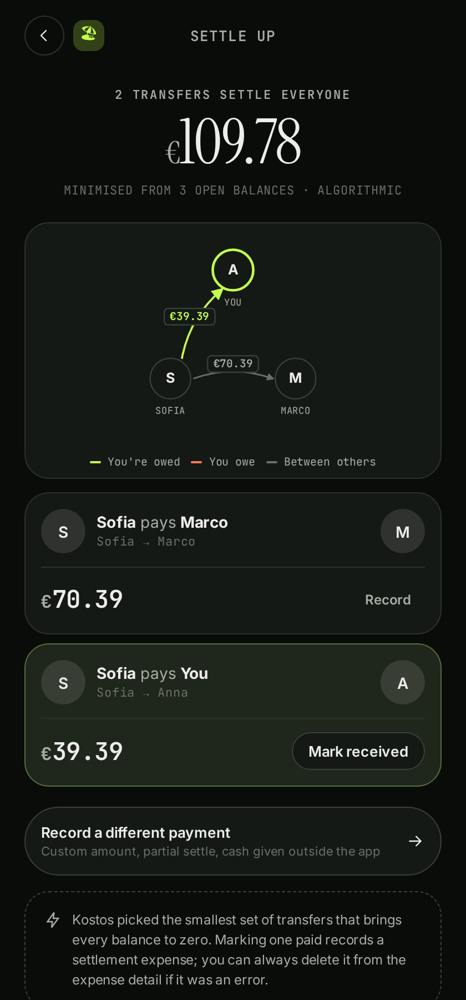
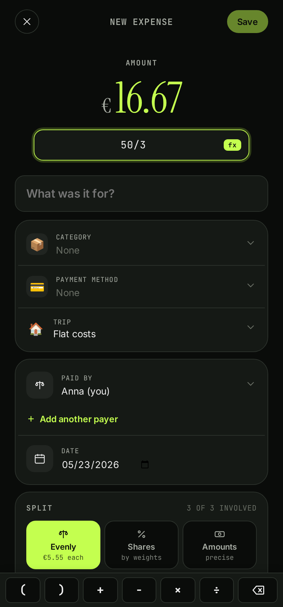
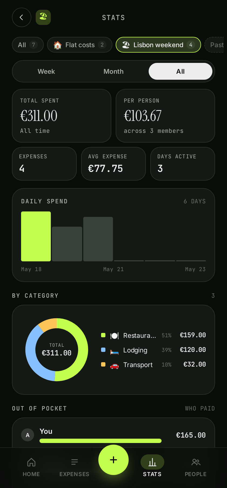
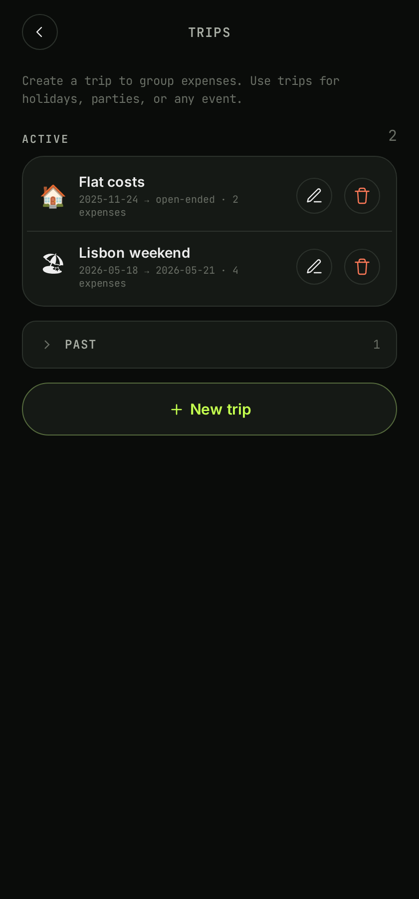

<h1 align="center">Kostos</h1>

<p align="center"><strong>Privacy-first group expense splitter PWA</strong>. No accounts. End-to-end encrypted. Works offline. Self-hostable.</p>

<p align="center">
  <a href="https://kostos.shynewt.com">Live demo</a> ·
  <a href="#screenshots">Screenshots</a> ·
  <a href="#deploy">Deploy</a> ·
  <a href="#why-v2">Why v2</a>
</p>

Kostos is a small web app for splitting bills with friends, housemates, or trip groups. Create a group, share its token, log expenses, settle up. No sign-up, no email, no password. Group state syncs live across every device that holds the token, and stays readable offline once you've opened it.

## Features

- **No accounts.** Groups are identified by a secret token that doubles as the invite link. Share the token, anyone with it joins. The server never sees the key.
- **End-to-end encrypted sync.** Every update is AES-GCM encrypted in the browser before reaching the sync relay. The relay stores opaque ciphertext.
- **Offline-first PWA.** Built on Y.js + IndexedDB. Add expenses on a plane; they sync the moment you come back online.
- **Conflict-free merging.** Two people editing the same expense from different devices? CRDTs reconcile without losing either edit.
- **Three split modes.** Evenly, by weighted shares, or by precise per-person amounts. Math expressions like `(120+5)/4` work inside any amount input, and a floating row of `+ − × ÷ ( )` keys docks above the on-screen keyboard so the operators aren't trapped behind a digit-only layout.
- **Multi-payer expenses.** When two people split the bill at dinner, both can be recorded as payers with the actual amounts each fronted.
- **Trips.** Tag expenses to a holiday, party, or any event with its own emoji and date range. Filter the home recents and stats page to a single trip. Past trips fold into a bottom sheet 30 days after they end, keeping the chip strip short. Balances and settlements stay global across the whole group.
- **Settle up.** A minimum-transfer plan suggests the fewest payments needed to bring everyone to zero. Mark them paid and they become regular settlement expenses.
- **Stats.** Per-period spend, daily/weekly/monthly bars, by-category donut, who-paid bars, biggest expenses, and a settlement graph for small groups.
- **Backup and restore.** Export any project as JSON (lossless backup) or CSV (one row per expense for spreadsheets) from Settings > Data. Drop a JSON file back into a new project to restore members, categories, payment methods, trips, and every expense.
- **QR invites.** Show the QR on one phone, scan on the other, you're in.
- **Multi-group.** A single device can hold many groups; switch between them from the landing.

## Screenshots

<table>
<tr>
<td align="center" width="33%">
<br/>
<sub>Project home</sub>
</td>
<td align="center" width="33%">
<br/>
<sub>Filtered by trip</sub>
</td>
<td align="center" width="33%">
<br/>
<sub>Settle up</sub>
</td>
</tr>
<tr>
<td align="center" width="33%">
<br/>
<sub>Math toolbar</sub>
</td>
<td align="center" width="33%">
<br/>
<sub>Stats per trip</sub>
</td>
<td align="center" width="33%">
<br/>
<sub>Manage trips</sub>
</td>
</tr>
</table>

Screenshots are captured by `npm run screenshots` (see [Development](#development)).

## Deploy

Two supported targets sharing the same static bundle and the same `/sync/<roomId>` WebSocket route.

### Cloudflare Workers (with static assets + Durable Objects)

```sh
npm install
wrangler login
npm run cf:deploy
```

`worker/index.ts` is the entry. It routes `/sync/*` to a `SyncRoom` Durable Object (in `src/lib/server/sync-do.ts`) and falls through to the static assets binding for everything else. The DO uses Hibernating WebSockets, so idle rooms cost no CPU. Configuration lives in `wrangler.toml`.

The SQLite-backed DO works on the Workers Free plan; no Workers Paid required for typical use.

### Docker / self-host

```sh
docker build -t kostos .
docker run -p 8080:8080 kostos
```

Or without Docker:

```sh
npm install
npm run build
node scripts/serve.js
```

`scripts/serve.js` serves the static bundle and handles `/sync/<roomId>` WebSocket upgrades on the same port (default 8080). History is in-memory, capped at 1000 messages per room. For long-running deployments, point a reverse proxy at it and pin a persistent volume if you swap the relay for a SQLite-backed one.

## Why v2

Kostos v1 was a Next.js + SQLite app where the server held every group's data. It worked, but it tied users to whatever instance hosted it and made the privacy story awkward: the operator could read every project. v2 rewrites the foundation:

- **No server-side database.** Sync happens through an encrypted relay that holds ciphertext only. Your group state lives on the devices that hold the token.
- **PWA over webapp.** Installable on iOS and Android home screens, runs without the browser chrome, fully offline-capable.
- **Live multi-device.** v1 needed manual refreshes between devices. v2 syncs in real time over WebSockets with Y.js CRDTs.
- **Token-based, not session-based.** v1 used localStorage to remember "who you are" per browser. v2 makes the token the identity: same token on a new device = same group, instantly.
- **Smaller and faster.** SvelteKit 5 + adapter-static ships ~150KB of JS gzipped. Initial paint is under a second on a 3G simulation.

**Migrating from v1.** v1 lives on the [`v1` branch](https://github.com/shynewt/kostos/tree/v1) of this repo and stays available for self-hosters who don't want to migrate yet. To move a project: open v1, export the project to JSON, then drop the file on `/import` in v2. The importer maps members, categories, payment methods, and every expense. Sub-cent rounding may shift even-split balances by ±1 cent vs v1 due to integer-cent arithmetic; totals are preserved.

## Development

```sh
npm install
npm run dev
```

Opens `http://localhost:5173/`. The dev server proxies `/sync/*` to `ws://localhost:1234`, where the legacy `npm run sync` script (a tiny `ws` relay) runs. Skip it for offline-only development; IndexedDB persistence keeps your group state local.

Scripts:

| Command | Purpose |
| --- | --- |
| `npm run dev` | Vite dev server on `:5173`. |
| `npm run build` | Static build into `build/` (adapter-static, SPA fallback on `200.html`). |
| `npm run preview` | Serve the built bundle locally. |
| `npm run check` | Type-check via svelte-check. |
| `npm test` | Vitest unit tests (balance engine, money formatting, v1 importer, math evaluator). |
| `npm run sync` | Local Node `ws` relay on port 1234 for dev sync. |
| `npm run cf:dev` | `wrangler dev` with local Durable Object emulation. |
| `npm run cf:deploy` | Build + deploy to Cloudflare Workers. |
| `npm run screenshots` | Capture the README screenshots via Playwright (dev server must be running on `:5173`). |

## Architecture

- **SvelteKit 5** with runes (`$state`, `$derived`, `$effect`). Strict TypeScript.
- **Y.js + y-indexeddb** for local-first CRDT state. Project data is a single `Y.Doc` per group.
- **AES-GCM** key derived from the secret half of the project token, never sent to the server.
- **Cloudflare Durable Object** for the sync relay in production, with `acceptWebSocket()` hibernation so idle rooms cost nothing.
- **Self-host Node server** is a small `http` + `ws` relay that speaks the same wire protocol as the Worker.

## License

GPL-3.0, same as v1.
